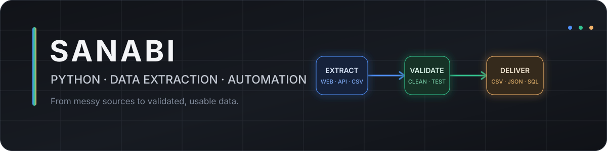

  

 

# Oleksandr Grachov

Python developer focused on **data extraction, document processing, and practical automation**.

I build small, reliable systems that collect messy data, clean and validate it, and export something useful: CSV, Excel, JSON, SQLite, or a readable report.

Currently open to freelance work involving web scraping, PDF extraction, data cleaning, and Python automation.

## Selected projects

### [PDF Price List Extractor](https://github.com/Mr-sanabi/pdf-price-list-extractor)

A CLI pipeline for turning text-based PDF price lists into validated CSV or Excel datasets. It reconstructs table rows from PDF coordinates, normalizes records, separates rejected data, and includes 40 automated tests.

`Python · PyMuPDF · openpyxl · pytest`

### [Product Catalog Data Pipeline](https://github.com/Mr-sanabi/product-catalog-data-pipeline)

A multi-source ETL pipeline that combines scraped catalog data and CSV datasets in one 13-field schema, with validation, deduplication, rejected-record tracking, analytics, and reproducible exports.

`Python · Requests · Beautiful Soup · CSV/JSON · pytest`

### [Website Change Monitor](https://github.com/Mr-sanabi/website-change-monitor-lite)

A lightweight monitor for detecting visible-text changes on public pages. It uses deterministic hashes, atomic state updates, failure-safe persistence, and structured CSV reports.

`Python · Requests · Beautiful Soup · SHA-256 · pytest`

## Other work

- [Multi-page Catalog Scraper](https://github.com/Mr-sanabi/multi-page-catalog-scraper) — pagination, resilient requests, logging, and CSV/JSON/Markdown exports.
- [Shopify Collection Exporter](https://github.com/Mr-sanabi/shopify-collection-exporter-lite) — targeted collection and variant exports to CSV.
- [Job Scraper with Email Alerts](https://github.com/Mr-sanabi/job-scraper-project) — filtering, deduplication, persistent state, and email notifications.

## Tools I use

Python 3.11+, Requests, Beautiful Soup, Playwright, PyMuPDF, openpyxl, SQLite, FastAPI, pytest, Git.

---

[Email](mailto:sanabi.dev@proton.me) · Poland
